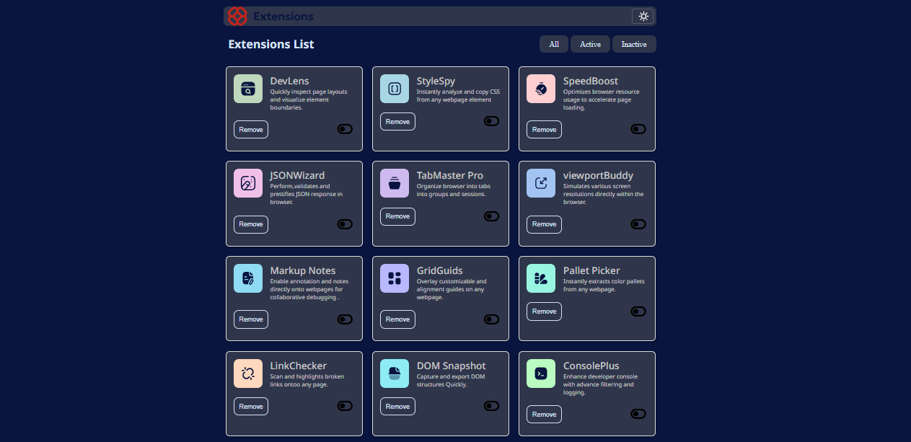

# Frontend Mentor - Browser extensions manager UI solution

This is a solution to the [Browser extensions manager UI challenge on Frontend Mentor](https://www.frontendmentor.io/challenges/browser-extension-manager-ui-yNZnOfsMAp). Frontend Mentor challenges. 


## Live site  (https://extension-manager-interface.vercel.app/)
)

## Overview

### The challenge

Users should be able to:

- Toggle extensions between active and inactive states
- Filter active and inactive extensions
- Remove extensions from the list
- Select their color theme
- View the optimal layout for the interface depending on their device's screen size
- See hover and focus states for all interactive elements on the page

### Screenshot




### Links


- Live Site: (https://extension-manager-interface.vercel.app/)

## My process

### Built with

- Semantic HTML5 markup
- CSS custom properties
- Flexbox
- CSS Grid
- Mobile-first workflow


### What I learned

```html
 <div class="card-top">
             
            
               <p> <span>DevLens</span> <br>Quickly inspect page layouts and visualize element boundaries.</p>
             </div>
          <div class="btns-action">
            <button class="remove-btn">Remove</button>

             <i class="fa-solid fa-toggle-off"></i>
          </div>
        </div>
```
```css

.items {
    display: grid;
   grid-template-columns: repeat(3, 295px);
    gap: 10px;
    padding: 20px 0;
    width: 100%;
}
}
```
```js
    function filterCards(filter) {
        cards.forEach(card => {
            const isActive = card.querySelector('.fa-toggle-on') !== null;
            
            switch(filter) {
                case 'All':
                    card.style.display = 'block';
                    break;
                case 'Active':
                    card.style.display = isActive ? 'block' : 'none';
                    break;
                case 'Inactive':
                    card.style.display = isActive ? 'none' : 'block';
                    break;
            }
        });
}
```
## Thanks for visiting
